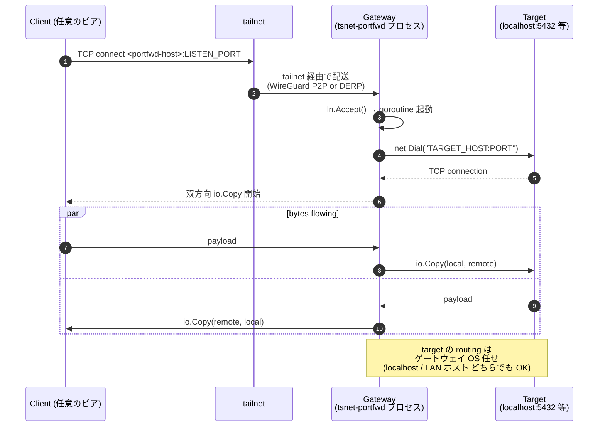
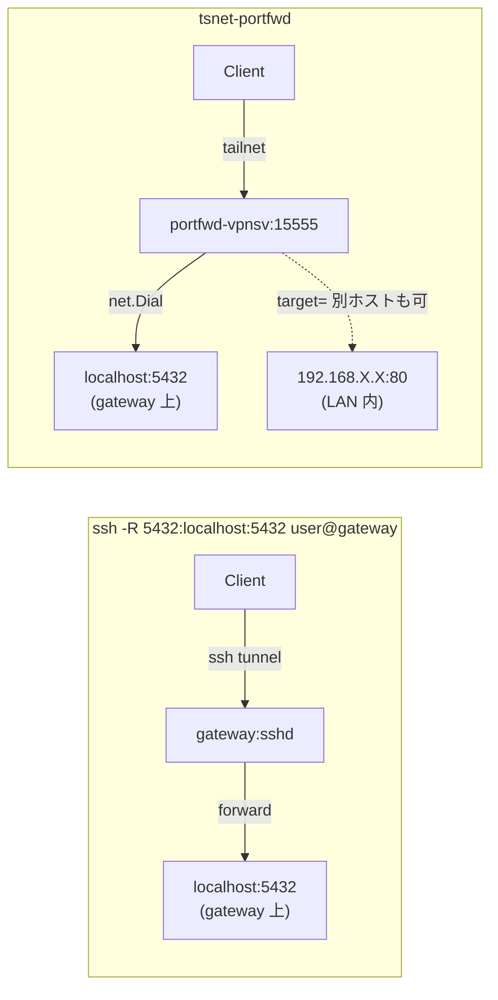

# tsnet-portfwd

> `tsnet` で実装した **`ssh -R` 相当の port forwarder**。 ローカル / LAN 内の任意の TCP サービスを自前 **Headscale** の tailnet に公開する。 ssh セッションも、 ファイアウォール開放も不要。

[](https://pkg.go.dev/tailscale.com/tsnet)
[](LICENSE)


## 概要

`ssh -R REMOTE_PORT:HOST:PORT user@gateway -N` の挙動を、 [`tailscale.com/tsnet`](https://pkg.go.dev/tailscale.com/tsnet) で書き直した単機能 daemon。

| | `ssh -R` | tsnet-portfwd |
|---|---|---|
| 認証 | SSH パスワード / 鍵 | **Tailscale 端末認証** (+ Headscale ACL) |
| セッション | ssh セッションに紐づく、 切れたら停止 | **プロセス常駐**、 ssh セッション不要 |
| 公開範囲 | サーバ側の `localhost` (または `GatewayPorts yes`) | **tailnet 全体に MagicDNS で公開** |
| 暗号化 | SSH トンネル | **WireGuard (P2P) または DERP リレー** |
| 多重化 | 1 セッションで複数 forward | プロセス 1 つで listen 何本でも (複数立てれば別ノード) |
| 障害分離 | SSH 全体が落ちる | port forward 単体プロセスだけ kill 可能 |

## アーキテクチャ

### 全体構成 (ASCII)

```
[クライアント (例: 手元の Mac)]

 ┌──────────────────┐
 │ Tailscale クライアント│
 │ (公式アプリ or     │
 │  別の tsnet バイナリ) │
 └────────┬─────────┘
          │  nc <portfwd-hostname> <LISTEN_PORT>
          │  curl http://<portfwd-hostname>:<LISTEN_PORT>/
          ▼
    [tailnet] (WireGuard P2P または DERP リレー)
          │
          ▼
[ゲートウェイマシン (例: 自宅サーバ)]

 ┌──────────────────────────────────────┐
 │ tsnet-portfwd プロセス               │
 │   srv.Listen(":LISTEN_PORT")         │
 │   net.Dial("TARGET_HOST:PORT")       │
 │   双方向 io.Copy()                    │
 └────────┬─────────────────────────────┘
          │
          ▼
   [TARGET (localhost または LAN 内の任意ホスト)]
   例: localhost:5432 (Postgres)
        192.168.X.X:80 (内部 nginx)
```

### 通信シーケンス (Mermaid)



### ssh -R との対応関係 (Mermaid)



## 前提

- Go 1.21+ (ビルドマシン)
- 自前 [Headscale](https://github.com/juanfont/headscale) (v0.28+ 推奨)
- `tsnet-portfwd` を動かすホスト (`-target` の host:port に OS routing で到達できる必要がある)

## クイックスタート

### 1. ビルド (Linux サーバ向けクロスコンパイルも併記)

```bash
git clone https://github.com/NOGUD626/tsnet-portfwd.git
cd tsnet-portfwd
go mod tidy
go build -o tsnet-portfwd .                          # 実行マシン向け

# Linux サーバ向けにクロスコンパイル
GOOS=linux GOARCH=amd64 go build -o tsnet-portfwd-linux .
scp tsnet-portfwd-linux user@gateway:/tmp/
```

### 2. 事前認証キーを発行

```bash
ssh <HEADSCALE_HOST> 'sudo headscale preauthkey create -u <USER_ID> -e 1h --reusable'
# → "hskey-auth-XXXX..." を取得
```

### 3. ゲートウェイマシンで実行

```bash
export TS_AUTHKEY=hskey-auth-XXXX...
./tsnet-portfwd \
    -control-url https://headscale.example.com \
    -hostname my-portfwd \
    -listen :15555 \
    -target localhost:5432
```

### 4. tailnet 内の任意ピアからアクセス

```bash
# MagicDNS が効くクライアントなら
nc my-portfwd 15555

# Tailscale IP 直接でも可
nc 100.64.0.X 15555
```

## 使い方 (フラグ一覧)

```text
Usage of ./tsnet-portfwd:
  -hostname string
        tailnet 上のホスト名 (default "portfwd")
  -listen string
        tailnet 内で listen するアドレス (default ":15555")
  -target string
        転送先 host:port (default "localhost:5555")
  -control-url string
        Headscale の URL (default "https://headscale.example.com")
  -state-dir string
        tsnet state dir (default "./portfwd-state")
  -v    tsnet の詳細ログを表示
```

## 例

### 1) ローカル PostgreSQL を tailnet に公開 (古典的な `ssh -R 5432:localhost:5432`)

```bash
./tsnet-portfwd -hostname pg-bridge -listen :5432 -target localhost:5432
# 任意のピアから:
psql -h pg-bridge -p 5432 -U user dbname
```

### 2) LAN 内の別ホストをゲートウェイ越しに公開

`-target` は `localhost` に限らない。 ゲートウェイの OS routing で到達できれば何でも OK。

```bash
./tsnet-portfwd -hostname web-bridge -listen :18080 -target 192.168.X.X:80
# 任意のピアから:
curl http://web-bridge:18080/
curl -H 'Host: internal-app.example' http://web-bridge:18080/
```

### 3) SSH 自体をブリッジ (ピアがホスト名で gateway 越し ssh できる)

```bash
./tsnet-portfwd -hostname ssh-bridge -listen :12222 -target localhost:22
ssh -p 12222 user@ssh-bridge
```

### 4) 同じマシンで複数 forward を並走

`-hostname` / `-listen` / `-state-dir` を変えて複数プロセスを起動するだけ:

```bash
./tsnet-portfwd -hostname pg-bridge  -listen :5432 -target localhost:5432  -state-dir ./pg-state &
./tsnet-portfwd -hostname web-bridge -listen :18080 -target 192.168.X.X:80 -state-dir ./web-state &
```

各プロセスが **独立した tailnet ノード** として登録され、 それぞれ Tailscale IP を持つ。

## 内部で何が起きているか

```
1. srv.Up()                  : tailnet に参加して Tailscale IP を取得
2. ln := srv.Listen(LISTEN)  : tsnet 内に userspace TCP listener を起動
3. for { conn := ln.Accept() ; go handle(conn) }
4. handle:
     local, _ := net.Dial("tcp", TARGET)
     go io.Copy(local, conn)       // peer  → target
     go io.Copy(conn, local)       // target → peer
```

中身は **双方向 `io.Copy`** だけ。 ssh -R が `ssh` の bytestream の中でやっていることを、 WireGuard の bytestream の中でやっている。

## トラブルシューティング

| 症状 | 対処 |
|---|---|
| `tsnet up failed: 401 Unauthorized` | AuthKey が期限切れ or 既に使用済。 新規発行 (`headscale preauthkey create`) |
| `tsnet up failed: tls handshake failed` | Headscale 側の TLS / リバースプロキシ設定を確認 |
| `Dial: i/o timeout` (target が LAN ホスト) | ゲートウェイ OS から target に到達できるか確認 (同 LAN なら通常 OK) |
| MagicDNS で名前解決できない | クライアント側で `tailscale set --accept-dns=true` |
| 2 回目に hostname 重複エラー | `headscale nodes delete -i <ID>` で旧ノード削除 or `-state-dir` を変える |

## 片付け

```bash
# 1. プロセスを止める
pkill tsnet-portfwd

# 2. ローカル state を削除
rm -rf ./portfwd-state

# 3. Headscale 側からノード削除
ssh <HEADSCALE_HOST> 'sudo headscale nodes list'
ssh <HEADSCALE_HOST> 'sudo headscale nodes delete -i <ID> --force'
```

## 拡張アイデア

| アイデア | 実装の方向 |
|---|---|
| **WhoIs ベース ACL** | `LocalClient().WhoIs(conn.RemoteAddr())` で接続元 Tailscale ID を取得して許可リスト判定 |
| **TLS 終端** | `srv.ListenTLS(":443")` で Let's Encrypt 連携相当の HTTPS リバプロ化 |
| **複数 target のラウンドロビン** | target を `host1:80,host2:80` のカンマ区切りに、 順番に Dial |
| **アクセスログ** | accept のたびに JSON で structured log 出力 |
| **メトリクス** | Prometheus exporter を同居 |

## 関連プロジェクト

- [tsnet パッケージドキュメント](https://pkg.go.dev/tailscale.com/tsnet)
- [Headscale](https://github.com/juanfont/headscale) — オープンソースの Tailscale コーディネーションサーバ
- [`tsnet-demo`](https://github.com/NOGUD626/tsnet-demo) — 姉妹リポジトリ: tailnet 参加 + Ping/Dial 検証
- [shayne/tsnet-serve](https://github.com/shayne/tsnet-serve) — TLS / Funnel / パスフィルタ等まで含む高機能版

## ライセンス

[MIT](LICENSE)

Tailscale および `tsnet` 自体は © Tailscale Inc.、 [BSD-3-Clause](https://github.com/tailscale/tailscale/blob/main/LICENSE) で提供されています。
